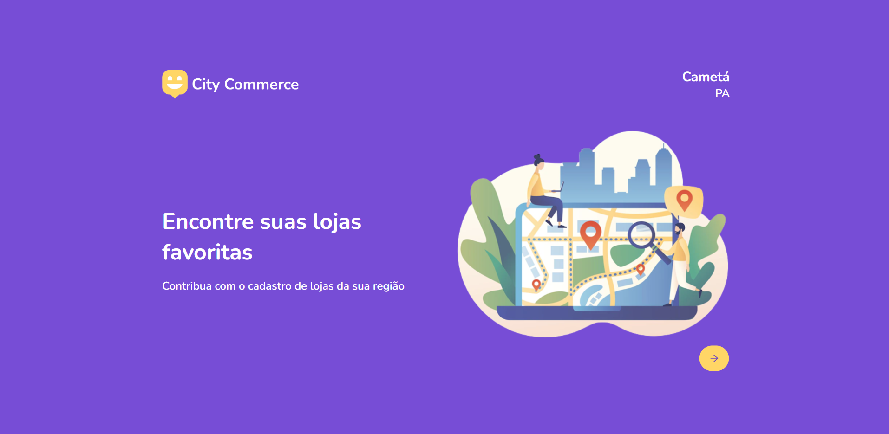
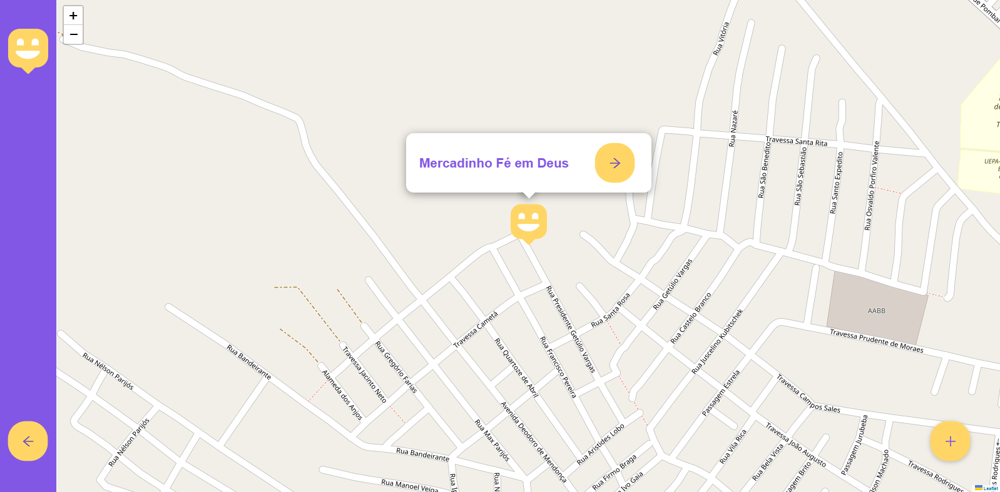
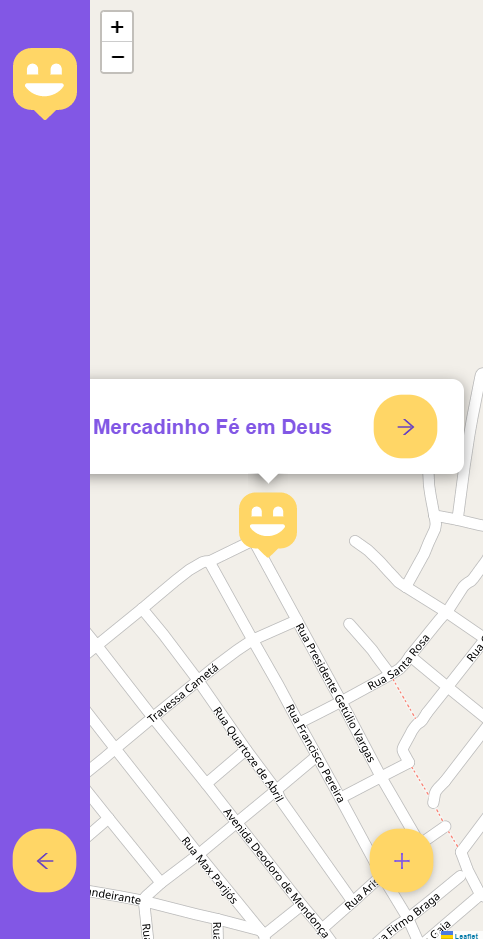
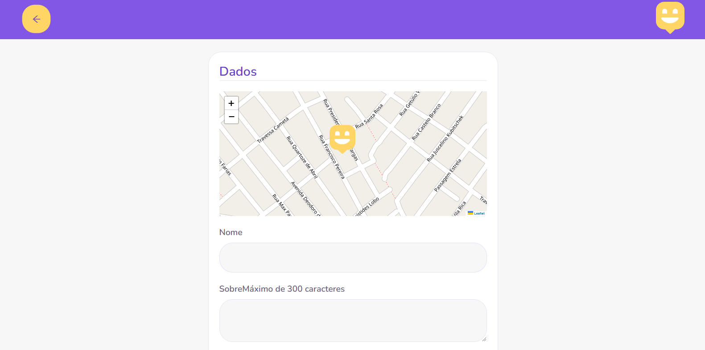
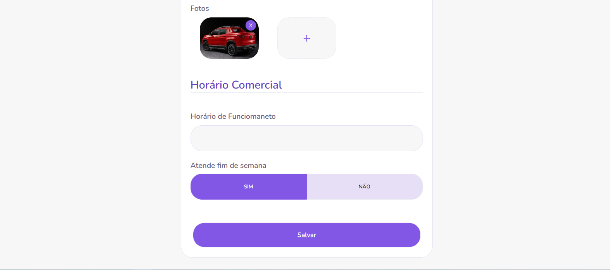
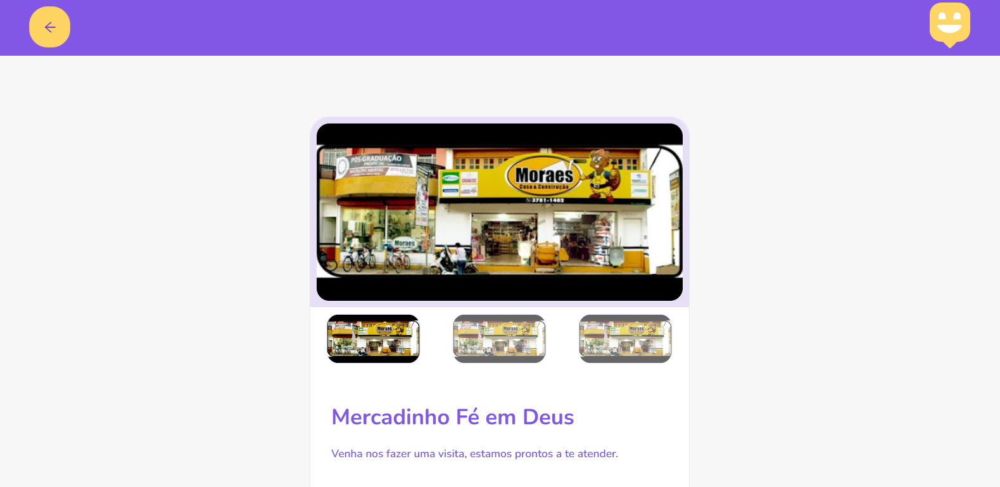

# city-commerce
# 💻 Projeto City Commerce

---
Projeto desenvolvido durante a disciplina Projeto Integrado II, no qual, deveríamos implementar funcionalidade extras ao projeto apresentado. Na sessão features, será detalhado as modificações e suas estruturas.
---


Desenvolvimento de uma aplicação frontend com ReactJS, para o cadastro de pontos comerciais do Baixo-Tocantins, todo o layout é responsivo para tablet e smartphone. Iremos utilizar Typescript, SCSS, axios, ReactRouterDom e ReactIcons.

<h3 align="center">
  Landing Page
</h3>

<p align="center">
  
  
</p>

<h3 align="center">
  Shops Map
</h3>

<p align="center">
  
  
</p>

<h3 align="center">
  New Shop
</h3>

<p align="center">
  
  
</p>

<h3 align="center">
  Details
</h3>

<p align="center">
  
  
  
</p>

## :rocket: Tecnologias Utilizadas
---

-  [Typescript](https://www.typescriptlang.org/)
-  [ReactJS](https://reactjs.org/)
-  [axios](https://github.com/axios/axios)
-  [ReactRouterDom](https://www.npmjs.com/package/react-router-dom)
-  [ReactIcons](https://www.npmjs.com/package/react-icons)
-  [ReactLeaflet](https://react-leaflet.js.org/)
-  [GoogleFonts](https://fonts.google.com/)

## Features

### Frontend:
  - Página de Login:
  


### Backend:
- Spring Framework
- Spring Boot
- Spring Data Jpa
  - ORM: Hibernate
  - Especificação: JPA
- Spring Security
- Autorização e Autenticação JWT
- Serviço de Email com SMTP Gmail
- Design Patterns
  - Strategy
  - Template Method
- Mysql

---
### Diagrama de fluxo de requisições da api

---
### Diagrama da arquitetura do server Spring com Spring Security


---
- **WebSecurityConfigurerAdapter** é o cerne da implementação de segurança. Ele fornece **HttpSecurity** configurações para configurar cors, csrf, gerenciamento de sessão, regras para recursos protegidos. Também podemos estender e personalizar a configuração padrão que contém os elementos abaixo.

– **UserDetailsService** *interface* tem um método para carregar usuário por nome de usuário e retorna um **UserDetails** objeto que Spring Security pode usar para autenticação e validação.

– **UserDetails** contém as informações necessárias (como: nome de usuário, senha, autoridades) para construir um objeto Autenticação.

– **UsernamePasswordAuthenticationToken** obtém {email, password} da solicitação de login, **AuthenticationManager** usará para autenticar uma conta de login.

– **AuthenticationManager** tem um **DaoAuthenticationProvider** (com ajuda de **UserDetailsService& PasswordEncoder**) para validar o **UsernamePasswordAuthenticationToken** objeto. Se for bem-sucedido, **AuthenticationManager** retornará um objeto do tipo Authentication totalmente preenchido (incluindo autoridades concedidas).

– **OncePerRequestFilter** faz uma única execução para cada solicitação à nossa API. Ele fornece um **doFilterInternal()** método que implementaremos analisando e validando o JWT, carregando os detalhes do usuário (usando **UserDetailsService**), verificando a autorização (usando **UsernamePasswordAuthenticationToken**).

– **AuthenticationEntryPoint** detectará o erro de autenticação.

- O  serviço contém **UsuarioService** para trabalhar com o repositório que contém **UserRepository** para trabalhar com Banco de Dados, que será importado para o Controller.

- O controlador recebe e manipula a solicitação depois que ela foi filtrada por **OncePerRequestFilter**.

- UsuarioController também lida com solicitações de inscrição/login/recuperar-senha.

### Estrutura do Projeto

---
### Padronização de Erros com a RFC 7807 Problem Details for HTTP APIs
A RFC 7807 é uma especificação que visa padronizar os formatos de mensagens de erro em APIs HTTP, para assim evitar que novos formatos sejam criados.
---
### Versões
- Java 17
- Spring 2.6.3
- Maven 4.0.0
- jjwt 0.7.0
- Mysql 8.0

### Propriedades

Você deve utilizar suas proprias credenciais no application.properties

```
spring.datasource.url=jdbc:mysql://localhost:3306/commercedb?createDatabaseIfNotExist=true&serverTimezone=UTC
spring.datasource.username=wgroot // username do banco de dados
spring.datasource.password=admin // senha do banco de dados

#spring.jpa.generate-ddl=true 
spring.jpa.hibernate.ddl-auto=create // recria as tabelas no banco

spring.security.user.name=wgroot
spring.security.user.password=admin

jwt.secret=SequenciaParaAssinarToken
jwt.expiration=60000 //60 mil milissegundos é 1 minuto

default.sender=guto15santos@gmail.com //email padrao
default.recipient=guto15santos@gmail.com //email padrao

spring.mail.host=smtp.gmail.com
spring.mail.username=guto15santos // antes do @gmail
spring.mail.password= //configurar senha de apps menos seguro nas configurações de segurança da sua conta google
spring.mail.properties.mail.smtp.auth = true
spring.mail.properties.mail.smtp.socketFactory.port = 465
spring.mail.properties.mail.smtp.socketFactory.class = javax.net.ssl.SSLSocketFactory
spring.mail.properties.mail.smtp.socketFactory.fallback = false
spring.mail.properties.mail.smtp.starttls.enable = true
spring.mail.properties.mail.smtp.ssl.enable = true
```
