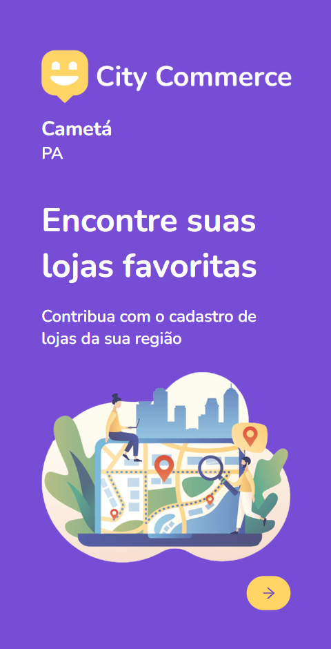
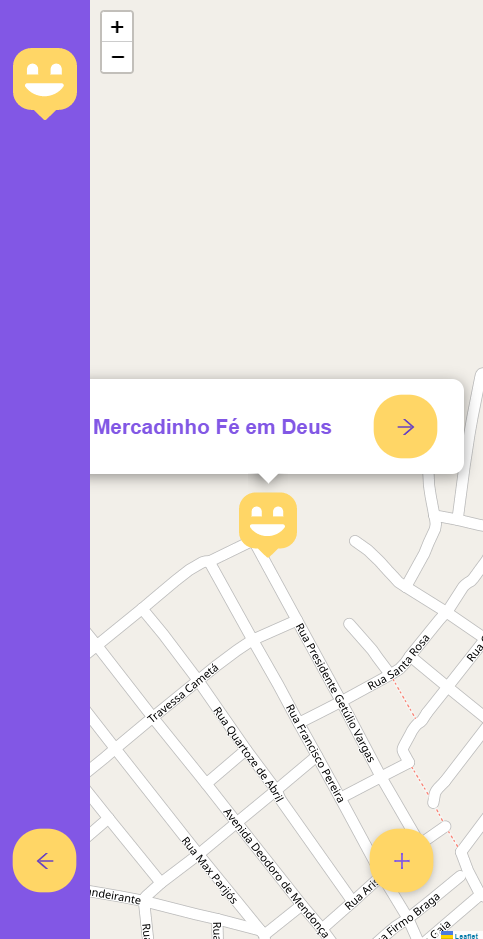
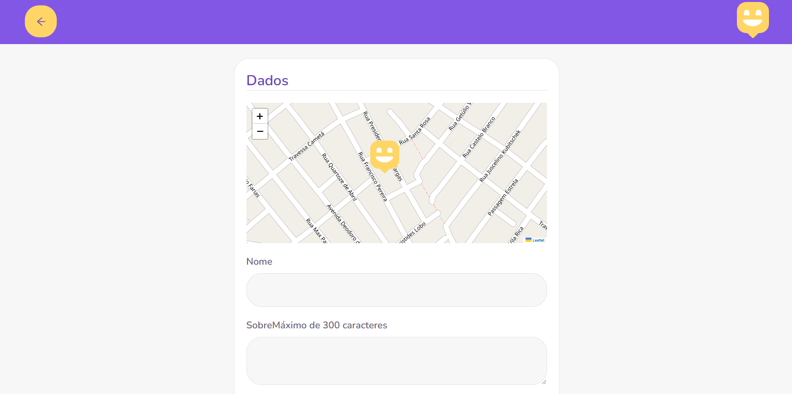
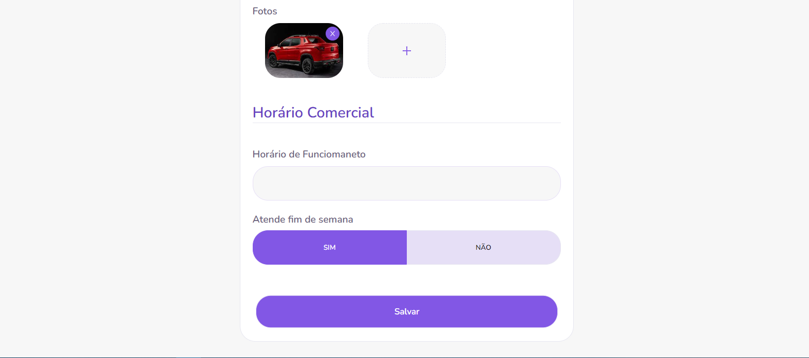

# city-commerce
# 💻 Projeto City Commerce

---
Projeto desenvolvido durante a disciplina Projeto Integrado II, no qual, deveríamos implementar funcionalidade extras ao projeto apresentado. Na sessão features, será detalhado as modificações e suas estruturas.
---

Desenvolvimento de uma aplicação frontend com ReactJS, para o cadastro de pontos comerciais do Baixo-Tocantins, todo o layout é responsivo para tablet e smartphone. Iremos utilizar Typescript, SCSS, axios, ReactRouterDom e ReactIcons.

<h3 align="center">
  Landing Page
</h3>

  
  

<h3 align="center">
  Shops Map
</h3>

  
  

<h3 align="center">
  New Shop
</h3>

  
  

<h3 align="center">
  Details
</h3>

  
  
  

## :rocket: Tecnologias Utilizadas
---

-  [Typescript](https://www.typescriptlang.org/)
-  [ReactJS](https://reactjs.org/)
-  [axios](https://github.com/axios/axios)
-  [ReactRouterDom](https://www.npmjs.com/package/react-router-dom)
-  [ReactIcons](https://www.npmjs.com/package/react-icons)
-  [ReactLeaflet](https://react-leaflet.js.org/)
-  [GoogleFonts](https://fonts.google.com/)

## Features

### Frontend:
  - P√°gina de Login:
  

### Backend:
- Spring Framework
- Spring Boot
- Spring Data Jpa
  - ORM: Hibernate
  - Especificação: JPA
- Spring Security
- Autorização e Autenticação JWT
- Serviço de Email com SMTP Gmail
- Design Patterns
  - Strategy
  - Template Method
- Mysql
